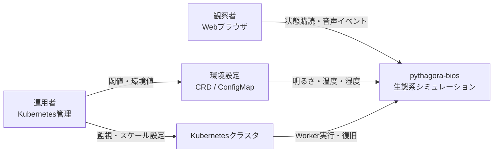
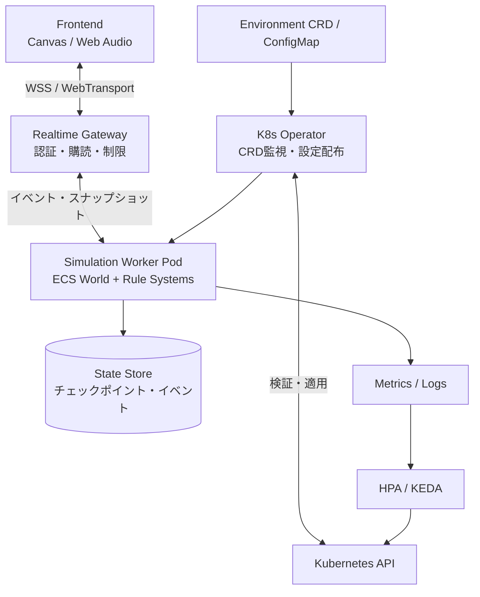
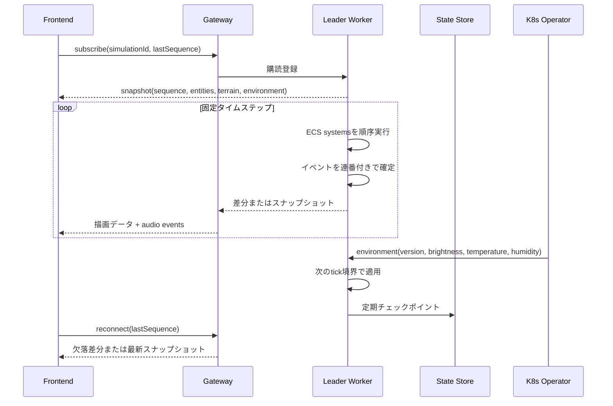
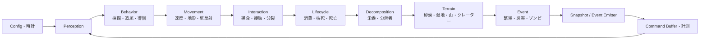
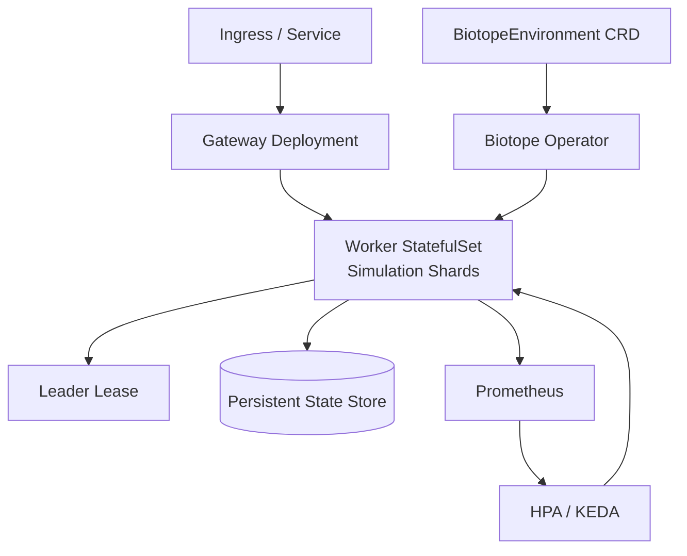

# アーキテクチャ設計書（pythagora-bios）

## 1. 設計目標と前提

要求仕様の `F-01`〜`F-10` と `NFR-01`〜`NFR-12`を実現する。観察者はブラウザで状態を購読し、シミュレーションの正本はWorker Podが保持する。

- 1シミュレーションIDにつき書き込み権を持つLeader Workerは1つとする。
- 固定タイムステップ（既定60Hz）と描画フレームレートを分離する。
- Workerはイベントをサーバー時刻と連番で確定し、クライアントはスナップショットを購読する。
- 未指定閾値はバージョン付きConfigMapで管理する。

## 2. C4 Model

### 2.1 Level 1: System Context


### 2.2 Level 2: Container


| コンテナ | 責務 | 状態 |
| --- | --- | --- |
| Frontend | Canvas描画、補間、音声合成 | 最新スナップショット |
| Realtime Gateway | 認証、購読、レート制限、配信 | 接続の一時状態 |
| Simulation Worker | ECS更新、ルール、イベント、チェックポイント | シミュレーション正本 |
| K8s Operator | CRD/ConfigMap検証、設定配布、再起動調整 | 適用状態 |
| State Store | チェックポイント、監査用イベントログ | 永続状態 |

## 3. 実行時データフロー



通常は差分イベントを配信し、再接続時または差分が過多の場合は完全スナップショットを返す。Gatewayは個体状態を書き換えず、正本をWorkerへ集約する。

## 4. ECS設計

Entityは再利用可能な整数ID、Componentは型ごとのStructure of Arrays（SoA）で保持する。

| Component | フィールド例 | 対象 |
| --- | --- | --- |
| Position | `x`, `y`, `previousX`, `previousY` | 全Entity |
| Velocity | `x`, `y`, `baseSpeed` | 個体、水流 |
| Species | `kind`, `colorVariant`, `blinkPhase` | 草食、肉食、ゾンビ |
| Energy | `value`, `metabolicRate` | 個体 |
| Perception | `baseRange`, `effectiveRange` | 個体 |
| Life | `bornAt`, `expiresAt`, `alive` | 草、個体、死骸 |
| Mutation | `speedFactor`, `sightFactor` | 個体 |
| Corpse / Decomposer | `decomposition`, `nutrientYield`, `density` | 死骸、分解者 |
| TerrainCell | `kind`, `fertility`, `eventHeat` | グリッドセル |
| EventTag | `type`, `sequence`, `sourceId` | 今tickのイベント |

```text
World
  positions: SoA { x[], y[], previousX[], previousY[] }
  velocities: SoA { x[], y[], baseSpeed[] }
  energies: SoA { value[], metabolicRate[] }
  perceptions: SoA { baseRange[], effectiveRange[] }
  lifecycles: SoA { bornAt[], expiresAt[], alive[] }
  terrain: Grid<TerrainCell>
  events: RingBuffer<Event>
  freeIds: Stack<EntityId>
```

削除は`alive=false`と削除キューで記録し、tick末尾にSwap-and-Popする。イベントには世代番号を付け、古いEntity参照を無効化する。Spatial Hashで近傍探索を局所化し、描画には必要なComponentだけをPacked Snapshotへ変換する。

### 4.1 System実行順序


各Systemは直接Entityを生成・削除せずCommand Bufferへ命令する。InteractionSystemは対象を予約し、tick末尾に一度だけ確定する。tickごとに状態ハッシュ、個体数、主要イベントを記録する。

## 5. 配置、スケーリング、復旧



- シミュレーションIDをShardキーとし、1Shardを1Leader Workerが処理する。
- CPU負荷と個体数をメトリクス化し、80%閾値でHPA/KEDAを起動する。
- Leader Leaseの失効後にのみ昇格し、同じShardを二重実行しない。
- Worker停止時はチェックポイントとイベント連番から再開する。
- Operatorはschema検証後、`environmentVersion`を増加させ、次tick境界で全Workerへ適用する。

## 6. クライアント設計

受信スナップショットの前後を補間してCanvasへ描画する。生物は1x1〜3x3px、変異は色相・点滅・形状の差で表現し、色だけに依存しない。音声層はイベントを左右パンとピッチへ変換し、安定時は和音、繁殖・災害時は速い不協和音へ遷移する。AudioContextの開始要求や権限拒否があっても描画は継続する。

## 7. ADR（簡易版）

### ADR-001: ECSを採用する

- **Context:** 数千体と短命Entityを毎tick更新する。
- **Decision:** Entity ID、SoA Component、System順序、Command Bufferを使う。
- **Rationale:** 密な走査でキャッシュ効率を高め、GC負荷を避ける。
- **Trade-off:** 動的型追加とデバッグの可読性が下がるため、境界とイベントログで補う。

### ADR-002: WebSocketを標準、WebTransportを拡張候補とする

- **Context:** 低遅延配信とブラウザ互換性が必要。
- **Decision:** 初期はWSS WebSocket、WebTransportはAdapter経由とする。
- **Rationale:** WebSocketの成熟した順序付きストリームで観察用途を満たす。
- **Trade-off:** 多重ストリームの柔軟性が低いため、Adapterで置換範囲を限定する。

### ADR-003: Canvas 2DとWeb Audio APIを採用する

- **Context:** 極小ドットの大量描画とイベント由来の音声合成が必要。
- **Decision:** Canvas 2DとWeb Audio APIを使う。
- **Rationale:** DOMより大量描画に適し、音声ファイルよりイベント合成に合う。
- **Trade-off:** 高密度イベントでは音声を量子化・合成し上限を設ける。

### ADR-004: Kubernetes Operator + HPA/KEDAを採用する

- **Context:** CPUと個体数でWorkerを増減し、環境値を全Podへ配布する。
- **Decision:** CRDをOperatorが検証・配布し、HPA/KEDAがメトリクスを利用する。
- **Rationale:** ドメイン設定とPodライフサイクルを宣言的に統合できる。
- **Trade-off:** Kubernetes依存が増えるため、ローカルでは同じスキーマのモックを使う。

### ADR-005: Leader Workerをシミュレーション正本とする

- **Context:** 複数Podの同時更新はイベント順序を競合させる。
- **Decision:** ShardごとにLeaderを1つ置き、他Podは購読または候補とする。
- **Rationale:** 単一書き込み元と連番付きイベントで二重計上を抑える。
- **Trade-off:** Leaderがボトルネックになり得るため、Shard分割と復旧で拡張する。

## 8. 設計検証項目

- `F-01`〜`F-09`を固定乱数seedの決定的ECSテストで検証する。
- `F-10`と`NFR-05`〜`NFR-07`をローカルKubernetesで検証する。
- `NFR-01`を個体数別の負荷試験で測定する。
- `NFR-06`と`NFR-12`を設定バージョン、イベント連番、状態ハッシュで比較する。
- `NFR-08`と`NFR-11`を音声拒否、低性能端末、色覚差の条件で確認する。
