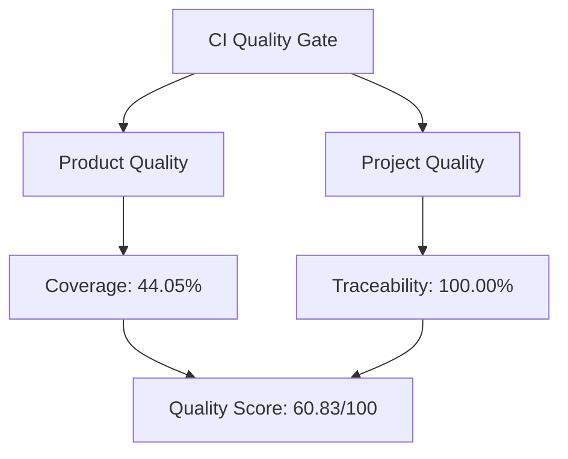

# Product Quality & Project Quality Dashboard

## Executive summary

The current release is in **needs attention** status with an overall quality score of **60.83/100**.

| Metric | Value | Status |
| --- | ---: | --- |
| Statement coverage | 44.05% | Needs attention |
| Requirement traceability | 100.00% | Healthy |
| Total requirements | 7 | N/A |
| Quality score | 60.83/100 | Needs attention |

-   :material-check-circle:  **Product quality**
    - Coverage: 44.05%
    - Status: Needs attention

-   :material-file-document-check: green  **Project quality**
    - Traceability: 100.00%
    - Status: Healthy

## Requirement coverage by category

| Category | Count |
| --- | ---: |
| functional | 4 |
| maintainability | 1 |
| performance_efficiency | 2 |

## Quality notes

- Coverage and traceability are measured from the live CI artifacts and the requirement model under `docs/requirements/data`.
- Dashboard generation is automatic and is designed to be published via GitHub Pages with Material for MkDocs.
- The next release should focus on raising the lowest-scoring area before broadening feature scope.

## Related artifacts

- JSON payload: [../reports/quality-report.json](../reports/quality-report.json)
- Requirement model: [../requirements.md](../requirements.md)
- Documentation guide: [../DOCS_SYSTEM_GUIDE.md](../DOCS_SYSTEM_GUIDE.md)
