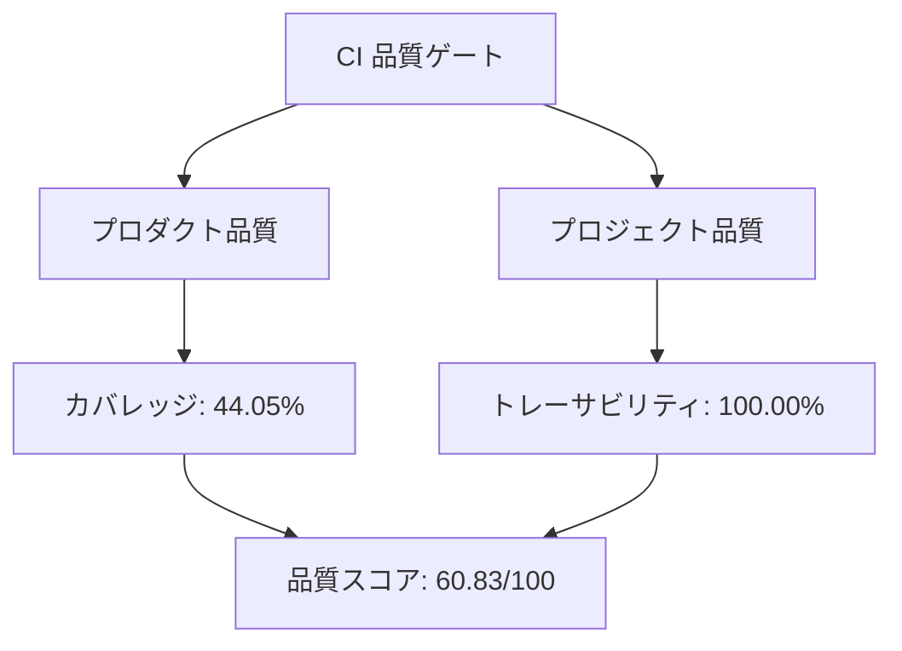

# プロダクト品質・プロジェクト品質ダッシュボード

## 概要

現在のリリースは **needs attention** 状態で、総合品質スコアは **60.83/100** です。

| 指標 | 値 | 状態 |
| --- | ---: | --- |
| カバレッジ | 44.05% | 要注意 |
| 要件トレーサビリティ | 100.00% | 健全 |
| 要件数 | 7 | N/A |
| 品質スコア | 60.83/100 | Needs attention |

-   :material-check-circle:  **プロダクト品質**
    - カバレッジ: 44.05%
    - 状態: 要注意

-   :material-file-document-check: green  **プロジェクト品質**
    - トレーサビリティ: 100.00%
    - 状態: 健全

## カテゴリ別の要件カバレッジ

| カテゴリ | 件数 |
| --- | ---: |
| functional | 4 |
| maintainability | 1 |
| performance_efficiency | 2 |

## 品質メモ

- カバレッジとトレーサビリティは、`docs/requirements/data` 配下の要求モデルと CI の実行結果から算出されています。
- ダッシュボードは自動生成され、Material for MkDocs と GitHub Pages によって公開されます。
- 次のリリースでは、最も低い指標を改善してから機能拡張を進めるのが望ましいです。

## 関連アーティファクト

- JSON 出力: [../reports/quality-report.json](../reports/quality-report.json)
- 要件モデル: [../requirements.md](../requirements.md)
- ドキュメントガイド: [../DOCS_SYSTEM_GUIDE.md](../DOCS_SYSTEM_GUIDE.md)
