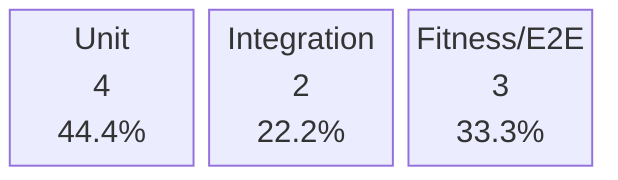
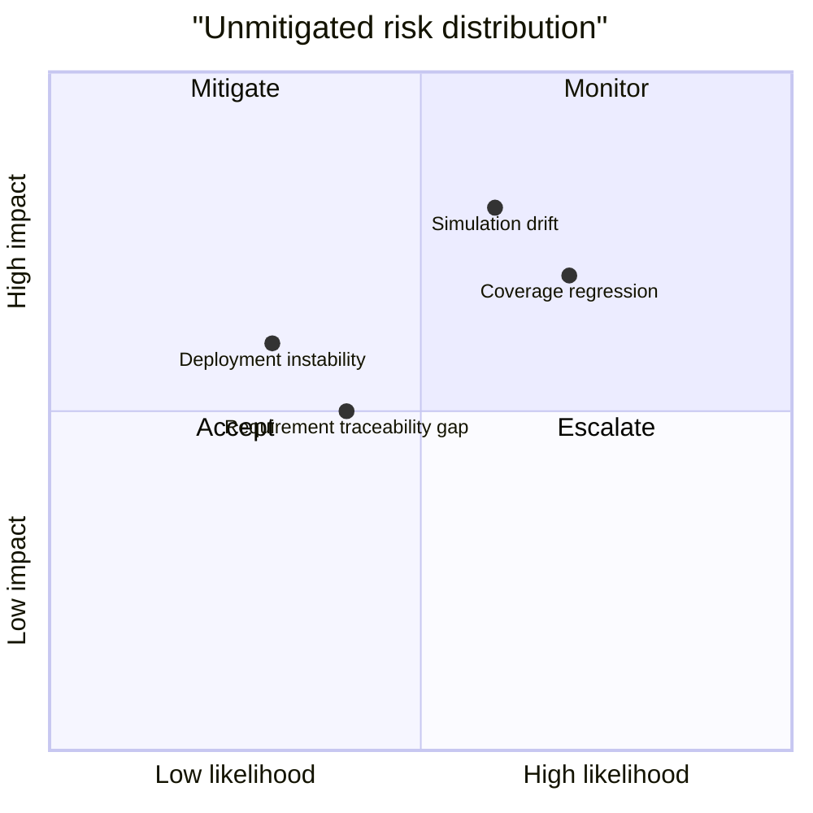

# 品質ダッシュボード

## KPI サマリー

| 指標 | 現在値 | 目標 | 判定 |
| --- | ---: | ---: | --- |
| プロダクト品質スコア | 60.83/100 | 80.00 | FAIL |
| テストカバレッジ | 44.05% | 75.00% | FAIL |
| 要件カバー率 | 100.00% | 90.00% | PASS |
| 静的解析エラー | 0 | 0 | PASS |
| 未対策リスク | 2 | 0 | FAIL |

## テストピラミッド

| レベル | 件数 | 構成比 | 通過状況 |
| --- | ---: | ---: | --- |
| Unit | 4 | 44.4% | 4 passed |
| Integration | 2 | 22.2% | 2 passed |
| Fitness / E2E | 3 | 33.3% | 3 passed |



## 品質トレンド

```mermaid
xychart-beta
    title "Coverage & requirement trend"
    x-axis ["B1"]
    y-axis "Percent (%)" 0 --> 100
    line ["Coverage", 44.0]
    line ["Requirement", 100.0]
```

```mermaid
xychart-beta
    title "Static analysis and CI trend"
    x-axis ["B1"]
    y-axis "Issues / success rate" 0 --> 100
    line ["Static issues", 0]
    line ["CI success", 100.0]
```

## リスクマトリクス



## 要件カテゴリ

| カテゴリ | 件数 |
| --- | ---: |
| functional | 4 |
| maintainability | 1 |
| performance_efficiency | 2 |

## 品質メモ

- 要件カバー率とカバレッジは CI と要求モデルから継続的に評価されます。
- 履歴データは reports/history.json に保存され、過去 10 ビルドを保持します。
- 静的解析の警告が 0 でない場合は、次回デプロイ前に対策を完了してください。

## 関連ファイル

- [../reports/quality-report.json](../reports/quality-report.json)
- [../reports/history.json](../reports/history.json)
- [../requirements.md](../requirements.md)
- [../test-strategy.md](../test-strategy.md)
