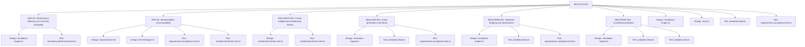

# Requirement Traceability

```mermaid
graph TD
    NFR_01["NFR-01: Performance efficiency for real-time simulation"]
    REQ_SYS_001["REQ-SYS-001"]
    REQ_SYS_001 --> NFR_01
    design_NFR_01_apps_worker_src_engine_simulation_engine_ts["Design: simulation-engine.ts"]
    NFR_01 --> design_NFR_01_apps_worker_src_engine_simulation_engine_ts
    test_NFR_01_tests_performance_simulation_performance_test_ts["Test: simulation.performance.test.ts"]
    NFR_01 --> test_NFR_01_tests_performance_simulation_performance_test_ts
    NFR_02["NFR-02: Maintainability and traceability"]
    REQ_SYS_001 --> NFR_02
    design_NFR_02_docs_requirements_md["Design: requirements.md"]
    NFR_02 --> design_NFR_02_docs_requirements_md
    design_NFR_02_docs_test_strategy_md["Design: test-strategy.md"]
    NFR_02 --> design_NFR_02_docs_test_strategy_md
    test_NFR_02_tests_acceptance_requirements_acceptance_test_ts["Test: requirements.acceptance.test.ts"]
    NFR_02 --> test_NFR_02_tests_acceptance_requirements_acceptance_test_ts
    test_NFR_02_src_architecture_fitness_test_ts["Test: architecture.fitness.test.ts"]
    NFR_02 --> test_NFR_02_src_architecture_fitness_test_ts
    REQ_ARCH_001["REQ-ARCH-001: Frame budget and architecture fitness"]
    REQ_SYS_001 --> REQ_ARCH_001
    design_REQ_ARCH_001_src_architecture_fitness_test_ts["Design: architecture.fitness.test.ts"]
    REQ_ARCH_001 --> design_REQ_ARCH_001_src_architecture_fitness_test_ts
    test_REQ_ARCH_001_src_architecture_fitness_test_ts["Test: architecture.fitness.test.ts"]
    REQ_ARCH_001 --> test_REQ_ARCH_001_src_architecture_fitness_test_ts
    REQ_GEN_001["REQ-GEN-001: Grass generation and decay"]
    REQ_SYS_001 --> REQ_GEN_001
    design_REQ_GEN_001_apps_worker_src_engine_simulation_engine_ts["Design: simulation-engine.ts"]
    REQ_GEN_001 --> design_REQ_GEN_001_apps_worker_src_engine_simulation_engine_ts
    test_REQ_GEN_001_tests_features_predation_feature["Test: predation.feature"]
    REQ_GEN_001 --> test_REQ_GEN_001_tests_features_predation_feature
    test_REQ_GEN_001_tests_acceptance_requirements_acceptance_test_ts["Test: requirements.acceptance.test.ts"]
    REQ_GEN_001 --> test_REQ_GEN_001_tests_acceptance_requirements_acceptance_test_ts
    REQ_HERB_001["REQ-HERB-001: Herbivore foraging and reproduction"]
    REQ_SYS_001 --> REQ_HERB_001
    design_REQ_HERB_001_apps_worker_src_engine_simulation_engine_ts["Design: simulation-engine.ts"]
    REQ_HERB_001 --> design_REQ_HERB_001_apps_worker_src_engine_simulation_engine_ts
    test_REQ_HERB_001_tests_features_predation_feature["Test: predation.feature"]
    REQ_HERB_001 --> test_REQ_HERB_001_tests_features_predation_feature
    test_REQ_HERB_001_tests_acceptance_requirements_acceptance_test_ts["Test: requirements.acceptance.test.ts"]
    REQ_HERB_001 --> test_REQ_HERB_001_tests_acceptance_requirements_acceptance_test_ts
    REQ_PRED_001["REQ-PRED-001: Conditional predation"]
    REQ_SYS_001 --> REQ_PRED_001
    design_REQ_PRED_001_apps_worker_src_engine_simulation_engine_ts["Design: simulation-engine.ts"]
    REQ_PRED_001 --> design_REQ_PRED_001_apps_worker_src_engine_simulation_engine_ts
    test_REQ_PRED_001_tests_features_predation_feature["Test: predation.feature"]
    REQ_PRED_001 --> test_REQ_PRED_001_tests_features_predation_feature
    test_REQ_PRED_001_tests_unit_predation_test_ts["Test: predation.test.ts"]
    REQ_PRED_001 --> test_REQ_PRED_001_tests_unit_predation_test_ts
    design_REQ_SYS_001_apps_worker_src_engine_simulation_engine_ts["Design: simulation-engine.ts"]
    REQ_SYS_001 --> design_REQ_SYS_001_apps_worker_src_engine_simulation_engine_ts
    design_REQ_SYS_001_apps_frontend_src_main_ts["Design: main.ts"]
    REQ_SYS_001 --> design_REQ_SYS_001_apps_frontend_src_main_ts
    test_REQ_SYS_001_tests_features_predation_feature["Test: predation.feature"]
    REQ_SYS_001 --> test_REQ_SYS_001_tests_features_predation_feature
    test_REQ_SYS_001_tests_acceptance_requirements_acceptance_test_ts["Test: requirements.acceptance.test.ts"]
    REQ_SYS_001 --> test_REQ_SYS_001_tests_acceptance_requirements_acceptance_test_ts
```
